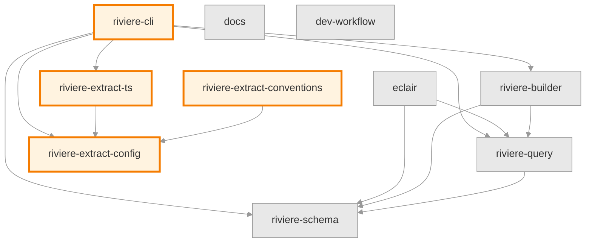
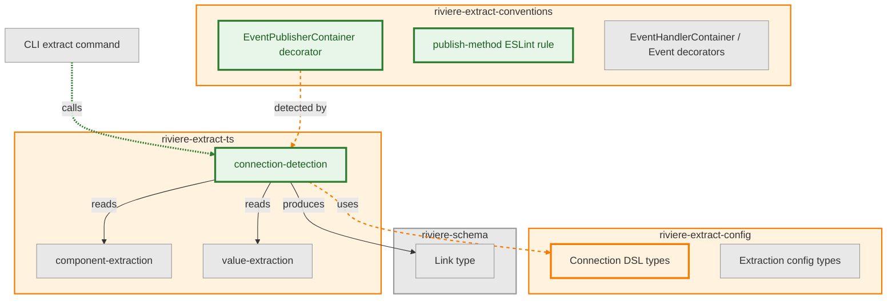
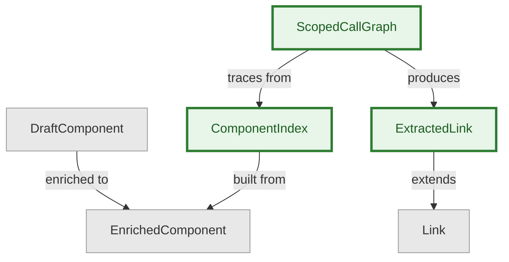
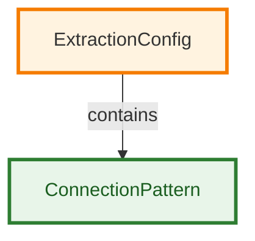
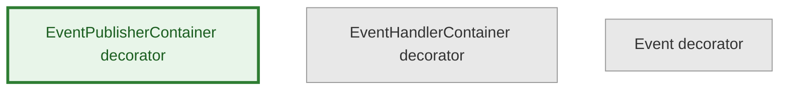

# PRD: Phase 12 — Connection Detection

**Status:** Approved

**Depends on:** Phase 11 (Metadata Extraction)

---

## 1. Problem

Components are identified (Phase 10) and enriched with metadata (Phase 11). Now we need to detect **connections** — the links between components that represent operational flow.

**Connection types:**
- **Sync calls**: API → UseCase → DomainOp (method invocations)
- **Async events**: Component publishes event, EventHandler subscribes

**Key principle: Non-components are transparent.**

When tracing flows, we trace through ALL code but only show components in the graph. Non-component classes (repositories, services, utilities) are invisible — we trace through them. A non-component is any class that does not appear in Phase 10/11 extraction output.

```text
Code call chain:     UseCase → Repository → Order.begin()
                               (not a component)

Graph shows:         UseCase → Order
```

This means we must build a **scoped call graph** — starting from known components and tracing outward through method calls — then filter to component-to-component edges. This is NOT whole-program call graph analysis; we only trace paths that originate from or pass through identified components.

**The core challenge:** JavaScript/TypeScript's dynamism makes call graph extraction inherently difficult. Academic research shows even best-in-class tools achieve ~91% recall — meaning they miss ~9% of real connections.

**Our insight:** If you **design code for extraction**, extraction becomes tractable. Codebases following our conventions can achieve 100% accurate extraction. Codebases that don't can still extract connections via configurable patterns or AI assistance.

**Why 100% is achievable for Golden Path:** Golden Path conventions require explicit types on constructor parameters and method signatures. This means connection detection uses **type-based resolution** — resolve calls via declared types, no flow-sensitive analysis or alias tracking needed. If the type is explicit, we resolve it. If not, fail fast.

---

## 2. Design Principles

### 2.1 Design for Extraction

**The fundamental principle:** Static analysis difficulty is a function of code design, not tooling sophistication.

| Hard to Analyze | Easy to Analyze |
|-----------------|-----------------|
| Runtime DI containers | Constructor injection with explicit types |
| Dynamic event names | String literal event names |
| `service.invoke(methodName)` | `service.specificMethod()` |
| Scattered dependencies | Explicit dependency declarations |
| Implicit conventions | Enforced conventions with decorators/interfaces |

**We promote the "easy to analyze" patterns as THE standard.** Teams that follow our conventions get 100% accurate extraction. We provide tooling that makes this the path of least resistance.

### 2.2 Two-Layer Extraction

Different codebases have different needs. We provide two layers:

| Layer | Use Case |
|-------|----------|
| **Golden Path** (deterministic, 100% for supported patterns) | Teams using our conventions |
| **Configurable** (accuracy depends on user-defined patterns) | Teams with existing patterns |

**Layer selection is per-extraction, not per-codebase.** A team might use Golden Path for their new code while using Configurable for modules with different conventions.

AI-assisted extraction already exists as a separate capability. Phase 12 focuses on deterministic extraction.

### 2.3 Fail Fast, Be Explicit

When Golden Path extraction cannot determine a connection with certainty:
- **Strict mode (default):** Fail with structured JSON error using the existing CLI error format (`{ success: false, error: { code, message, suggestions } }`). New error codes added to `CliErrorCode` for connection detection failures (e.g., `UNRESOLVABLE_TYPE`, `AMBIGUOUS_INTERFACE`, `MISSING_EVENT_MATCH`). Error message includes: file path, line number, what failed, and why (e.g., `"orders/src/use-cases/place-order.ts:15: unresolvable type — interface IOrderRepository has 3 implementations"`)
- **Lenient mode (`--allow-incomplete`):** Emit the link with an `_uncertain` field containing the reason for uncertainty (e.g., `"multiple implementations of IOrderRepository"`)

Uncertain links in lenient mode are included in the same `links` array with `_uncertain: string` — not a separate array. Strict mode output is a subset of lenient mode output (uncertain links are omitted entirely in strict mode).

Users should know exactly what was extracted and what wasn't. No silent failures.

### 2.4 Connections Have Source Locations

Every detected connection must reference where in the code it was detected. This enables:
- Clicking through from visualization to code
- Validating extraction correctness
- Understanding why a connection was detected

For transitive connections through non-components, the source location references the call site in the **source component** (where the chain originates), not intermediate non-component call sites.

This is an acceptance criterion on all connection detection deliverables, not a separate capability.

### 2.5 Type-Based Resolution

Connection detection uses **type-based resolution**: resolve method calls via the declared types of constructor parameters, fields, and variables. No flow-sensitive analysis, no alias tracking, no whole-program points-to analysis.

This is what makes Golden Path achievable — explicit types in code mean deterministic resolution in the extractor. When a type cannot be resolved (e.g., `any`, untyped variable), strict mode fails; lenient mode marks the connection as uncertain.

**Call graph algorithm:**

1. **Internal representation:** Method-level call graph. Nodes are methods, edges are method-to-method call sites resolved via declared types.
2. **Traversal:** From each component method, trace outward via DFS through method calls. Maintain a visited set per traversal path to handle cycles.
3. **Type resolution:** Resolve the receiver type of each call from constructor parameters, fields, or local variable declarations. Generic types match against the base type (e.g., `Repository<Order>` matches component `Repository`).
4. **Collapse:** After tracing, collapse non-component nodes to produce component-to-component links. One link per unique (source component, target component, type) tuple. Self-links (source === target) are excluded.
5. **Component lookup:** Phase 12 builds its own index from `EnrichedComponent[]` + AST. For method-level components (e.g., DomainOp), use `location.file` + `location.line` to locate the method in the AST and resolve its parent class.

**What is and isn't traced:**

| Pattern | Traced? | Reason |
|---------|---------|--------|
| `this.repo.save(order)` | ✅ | Direct method call, receiver type resolved |
| `await this.repo.save(order)` | ✅ | `await` is transparent |
| `this.repo.config` | ❌ | Property access (no getter), not a method call |
| `this.repo.activeOrders` (getter) | ✅ | Getters have method bodies that may call components; traced into during DFS |
| `this.repo.find(id).then(...)` | ✅ call only | `find()` traced; `.then()` callback not traced (requires flow analysis) |
| `const r = this.repo; r.save()` | ❌ | Requires alias tracking (out of scope) |
| Chained calls `a.b().c()` | ✅ each | Each call resolved independently via declared return type |

---

## 3. What We're Building

### 3.1 Golden Path — Convention-Based Extraction

**Pattern: Type-Based Method Call Detection**

Constructor parameters provide **type information** for resolving method calls. The connection comes from calling a method on a component-typed instance, not from the constructor declaration itself. An injected dependency that is never called does not create a link — it must represent actual operational flow.

```typescript
class PlaceOrderUseCase {
  constructor(
    private orderRepo: OrderRepository,  // provides type info for resolution
    private eventBus: EventBus
  ) {}

  execute(input: PlaceOrderInput) {
    const order = this.orderRepo.findById(input.orderId);  // → link to OrderRepository
    order.begin();                                           // → link to Order.begin DomainOp
  }
}
```

The extractor resolves `this.orderRepo` to type `OrderRepository` (from the constructor parameter declaration), then checks whether `OrderRepository` is in the known components set (from Phase 10/11 extraction output). If yes, the method call creates a link.

**Pattern: Explicit Event Publishing**

```typescript
// Connection detected via typed publish method signature
class OrderPublisher {
  publishOrderPlaced(event: OrderPlacedEvent): void {
    this.eventBus.publish(event);
  }
}
```

The extractor identifies methods whose parameter types are known Event components. Event matching: exact, case-sensitive string match of the parameter type name against Event component `metadata.eventName` from Phase 11 output. Zero matches in strict mode = fail. Multiple matches = fail (ambiguous). Lenient mode marks uncertain for both cases.

If the class containing the publish method is a component, it is the link source. If not, non-component transparency applies — trace back to the calling component.

**Pattern: Event Handler Subscription**

```typescript
// Connection detected via subscribedEvents metadata (from Phase 11)
@EventHandlerContainer
class OrderPlacedHandler {
  static readonly subscribedEvents = ['OrderPlaced'] as const;
}
```

Event → EventHandler connection derived from `subscribedEvents` metadata. Event names in `subscribedEvents` array matched to Event components via exact, case-sensitive string match against `metadata.eventName`.

**Pattern: Single-Implementation Interface Resolution**

```typescript
// Constructor declares interface type
class PlaceOrderUseCase {
  constructor(private repo: IOrderRepository) {}
}

// Exactly one class implements it
class OrderRepository implements IOrderRepository { ... }
```

When a constructor parameter or field is typed as an interface with exactly one implementing class, auto-resolve to the concrete type. Resolution scope: all TypeScript source files matched by extraction config module globs (node_modules excluded). Zero implementations or multiple implementations: fail fast in strict mode, mark as uncertain in lenient mode.

### 3.2 Configurable — Pattern Matching Extraction

For teams with existing conventions that differ from Golden Path.

**Core DSL — method call matching:**

```yaml
connections:
  patterns:
    - name: custom-event-publisher
      find: methodCalls
      where:
        methodName: publish
        receiverType: EventBus
      extract:
        eventName: { fromArgument: 0 }  # extracts static type name of first argument
      linkType: async
```

**Decorator-based matching (advanced):**

```yaml
connections:
  patterns:
    - name: nestjs-controller-to-service
      find: methodCalls
      where:
        callerHasDecorator: [Controller]
        calleeType: { hasDecorator: Injectable }
      linkType: sync
```

Decorator matching is name-only. `@Controller('/orders')` matches decorator name `Controller`. Parameters are ignored. Composed and factory decorators are not resolved — only direct decorators on the class are matched.

**Extraction rules (extending Phase 11 patterns):**
- `fromArgument: N` — Resolve the static type of the argument at position N, then read the property named by the `extract` key from that type's class definition. E.g., `publish(event: OrderPlacedEvent)` with `extract: { eventName: { fromArgument: 0 } }` → resolves `OrderPlacedEvent` class → reads its `eventName` static property value. If the type cannot be statically resolved or the property doesn't exist, fail fast in strict mode / mark uncertain in lenient mode.
- `fromReceiverType` — Extract the static type name of the object being called (e.g., `this.repo.save()` → extracts `OrderRepository` from declared type of `repo`)
- `fromCallerType` — Extract the static type name of the class containing the call site

**Connection config levels:**

```yaml
connections:              # Global defaults — inherited by all modules
  patterns:
    - name: custom-event-emitter
      find: methodCalls
      where:
        methodName: emit
        receiverType: CustomEventEmitter
      extract:
        eventName: { fromArgument: 0 }
      linkType: async

modules:
  - name: orders
    path: "orders/**"
    connections:           # Module-level — additive to global patterns
      patterns:
        - name: nestjs-controller-to-service
          find: methodCalls
          where:
            callerHasDecorator: [Controller]
            calleeType: { hasDecorator: Injectable }
          linkType: sync
```

Global patterns apply to all modules. Module-level patterns are additive — they run alongside global patterns for that module's scope. Interface resolution uses conventions only (single-implementation auto-resolve via D1.3), not manual mappings.

Connection config schema added to `riviere-extract-config` package. New `connections` key in extraction config (global and per-module), validated by JSON Schema.

### 3.3 Connection Output Format

**Breaking change:** The CLI `extract` command output shape changes from `{ success: true, data: EnrichedComponent[] }` to `{ success: true, data: { components: EnrichedComponent[], links: ExtractedLink[] } }`. The `--components-only` flag continues to output components without links. When no connections are detected, `links` is an empty array.

Each link conforms to the `Link` type from `riviere-schema` (with the addition of `_uncertain` for lenient mode). The examples below are illustrative — the schema is the spec.

The `repository` field in `sourceLocation` is populated from extraction config.

```json
{
  "links": [
    {
      "source": "orders:api:PlaceOrderController",
      "target": "orders:usecase:PlaceOrderUseCase",
      "type": "sync",
      "sourceLocation": {
        "repository": "ecommerce-demo-app",
        "filePath": "orders-domain/src/api/place-order/endpoint.ts",
        "lineNumber": 15,
        "methodName": "handle"
      }
    },
    {
      "source": "orders:usecase:PlaceOrderUseCase",
      "target": "orders:event:OrderPlaced",
      "type": "async",
      "sourceLocation": {
        "repository": "ecommerce-demo-app",
        "filePath": "orders-domain/src/api/place-order/use-cases/place-order-use-case.ts",
        "lineNumber": 42
      }
    }
  ]
}
```

### 3.4 CLI Interface

```bash
# Default: Golden Path only, strict mode
riviere extract --config ./config.yaml

# With configurable patterns (additive — Golden Path always runs, --patterns enables Configurable layer on top)
riviere extract --config ./config.yaml --patterns

# Lenient mode (emit uncertain links with _uncertain field instead of failing)
riviere extract --config ./config.yaml --allow-incomplete

# Show connection statistics (connection counts by type and detection method, uncertain link count)
riviere extract --config ./config.yaml --stats

# Dry run: run full extraction, output to stdout, do not write file
riviere extract --config ./config.yaml --dry-run
```

### 3.5 Performance Characteristics

No upfront targets. Record actual durations during implementation against ecommerce-demo-app, then decide acceptable thresholds. See D1.8 for instrumentation details and `docs/architecture/performance/phase-12-baselines.md` for recorded baselines.

### 3.6 "Design for Extraction" Documentation

Guide covering:
- Why code design affects extraction accuracy
- Golden Path conventions with examples
- Migration guide from legacy patterns
- Enforcement setup (ESLint rules, ArchUnitTS)

Location: `docs/guides/design-for-extraction.md`

---

## 4. What We're NOT Building

| Exclusion | Rationale |
|-----------|-----------|
| **Cross-repo linking** | Phase 14 scope |
| **Extraction workflows/orchestration** | Phase 13 scope |
| **External tool integrations** (EventCatalog, etc.) | Phase 13 scope — workflows will orchestrate integrations |
| **Runtime tracing** | Static analysis only |
| **Whole-program call graph** | We build scoped call graphs from known components, not exhaustive whole-program analysis |
| **Flow-sensitive analysis** | Golden Path uses type-based resolution; no alias tracking or points-to analysis |
| **HTTP client detection** | Deferred — complex, cross-repo implications |
| **Property injection, setter injection, method parameter injection** | Use Configurable layer for these patterns |
| **Promise `.then()` callback tracing** | Requires flow analysis; out of scope |
| **Variable alias tracking** | `const r = this.repo; r.save()` not supported; requires flow analysis |

---

## 5. Success Criteria

| # | Criterion | Verification |
|---|-----------|--------------|
| 1 | Golden Path extracts sync connections (method calls on component-typed instances) with source locations | Unit tests with 100% branch coverage of connection detection module |
| 2 | Golden Path extracts async connections (typed publish methods, event handler subscriptions) with source locations | Unit tests with 100% branch coverage of connection detection module |
| 3 | Scoped call graph traces through non-components correctly (single-hop, multi-hop, dead-end chains, cycles) | Integration tests against demo app |
| 4 | Single-implementation interfaces auto-resolve; zero/multiple fail fast | Unit tests covering zero, one, and multiple implementation cases |
| 5 | Configurable layer supports custom patterns via DSL | Config validation + extraction tests |
| 6 | ecommerce-demo-app achieves 100% connection extraction against defined ground truth | Comparison on (source, target, type) fields. Zero false positives, zero false negatives. |
| 7 | Performance baselines documented in `docs/architecture/performance/phase-12-baselines.md` | Each layer benchmarked against demo app, durations recorded |
| 8 | "Design for Extraction" guide published at `docs/guides/design-for-extraction.md` | Doc exists with all sections listed in D5.1, no TODO/TBD placeholders |
| 9 | Connection DSL documented | Doc exists with all sections listed in D5.2, no TODO/TBD placeholders |

---

## 6. Open Questions

1. **Transitive connections** — ✅ RESOLVED
   - Trace through non-components to find component-to-component flows
   - `UseCase → Repo → Order` shows as `UseCase → Order`
   - Source location references the call site in the source component

2. **Event publishing pattern** — ✅ RESOLVED
   - Golden Path: typed publish methods with specific event type argument
   - Example: `publishOrderPlaced(event: OrderPlacedEvent)`
   - TypeScript enforces correct event type at compile time
   - Detection: get argument type, match to already-extracted Event component via exact case-sensitive match on `metadata.eventName`
   - No argument analysis or inline `new` required
   - ESLint enforces Event classes have required static properties

3. **Confidence thresholds** — Removed. Lenient mode uses `_uncertain` field with reason string, not confidence scores.

4. **Inheritance chains** — Non-issue. ts-morph resolves inherited properties/methods. Inheritance is transparent to connection detection.

5. **Interface vs implementation** — ✅ RESOLVED
   - Golden Path: prefer concrete types (follows design-for-extraction principle)
   - Single implementation: auto-resolve if interface has exactly one implementing class within extraction config module globs (node_modules excluded)
   - Config mapping: manual mapping for legacy codebases, not type-safe so discouraged

6. **Performance targets** — ✅ RESOLVED
   - No targets set upfront
   - Record actual times during implementation
   - Duration displayed as final summary line with per-phase breakdown
   - Baselines recorded in `docs/architecture/performance/phase-12-baselines.md`
   - Decide acceptable thresholds after benchmarking against ecommerce-demo-app

7. **Call graph scope** — ✅ RESOLVED
   - Method-level internal call graph, collapsed to component-level for output
   - Type-based resolution: resolve via declared types, no flow-sensitive analysis
   - Cycle detection via visited set per traversal path
   - One link per unique (source, target, type) tuple
   - 100% accuracy achievable because Golden Path requires explicit types

8. **Generic types** — ✅ RESOLVED
   - Match against base type, ignore generic arguments
   - `Repository<Order>` matches component `Repository`

---

## 7. Milestones

### M1: Core Connection Extraction

All core connection types are extractable end-to-end. Scoped call graph traces through non-components, sync and async connections detected, CLI integration complete.

#### Deliverables

- **D1.1:** Scoped call graph construction
  - Build method-level call graph from known components using ts-morph
  - Type-based resolution: resolve calls via declared types on constructor parameters, fields, and variables
  - Build component lookup index from `EnrichedComponent[]` + AST (using `location.file` + `location.line` to resolve parent class for method-level components)
  - Cycle detection: maintain visited set per traversal path, skip already-visited methods
  - No flow-sensitive analysis or alias tracking
  - When type cannot be resolved: strict mode fails with error including file path, line number, unresolvable type name, and reason; lenient mode emits link with `_uncertain` field
  - Verification: Unit tests with 100% branch coverage
  - Architecture: see §9.1.2 (domain/connection-detection/call-graph/), §9.2.1 (ComponentIndex), §9.2.2 (ScopedCallGraph)

- **D1.2:** Non-component transparency
  - When a call chain passes through a non-component class, continue tracing until hitting another component or dead end
  - Produce component-to-component edges with the non-component chain elided
  - Handle chains of multiple non-components (A → non1 → non2 → B produces A → B)
  - Source location for transitive connections: the call site in the source component
  - One link per unique (source component, target component, type) tuple; if multiple call sites exist, source location references the lexically first occurrence (earliest file path, then earliest line number)
  - Verification: Unit tests covering single-hop, multi-hop, dead-end chains, and cycles
  - Architecture: see §9.2.2 (ScopedCallGraph collapse invariant), §9.1.2 (domain/connection-detection/call-graph/)

- **D1.3:** Single-implementation abstract type resolution
  - When a type is an interface or abstract class with exactly one implementing/extending class within ALL extraction config module globs combined (node_modules excluded), auto-resolve to the concrete type
  - Zero implementations: fail fast in strict mode, mark uncertain in lenient mode
  - Multiple implementations: fail fast in strict mode, mark uncertain in lenient mode
  - Verification: Unit tests covering zero, one, and multiple implementation cases
  - Architecture: see §9.1.2 (domain/connection-detection/interface-resolution/)

- **D1.4:** Sync connection detection
  - Method calls on component-typed instances: detect connections when calling methods on instances whose declared type is a known component
  - Constructor parameters provide type information for resolution — the method call creates the link, not the constructor declaration
  - Every connection includes `sourceLocation` (file path, line number, method name)
  - Verification: Unit tests with 100% branch coverage
  - Architecture: see §9.1.2 (domain/connection-detection/sync-detection/), §9.2.1 (ComponentIndex), §9.2.3 (ExtractedLink)

- **D1.5:** Async connection detection — publish side
  - Typed publish methods: detect methods whose parameter types match known Event components from Phase 11
  - Match parameter type name to Event component `metadata.eventName` — exact, case-sensitive string match
  - Zero matches: fail in strict mode, mark uncertain in lenient mode. Multiple matches: fail in strict mode, mark uncertain in lenient mode
  - If class containing publish method is a component, it is the link source; if not, apply non-component transparency
  - Every connection includes `sourceLocation`
  - Depends on: D1.7 (publish method convention must be defined first)
  - Verification: Unit tests with 100% branch coverage
  - Architecture: see §9.1.2 (domain/connection-detection/async-detection/), §9.2.4 (@EventPublisherContainer), §9.2.1 (ComponentIndex)

- **D1.6:** Async connection detection — subscribe side
  - Derive Event → EventHandler connections from `subscribedEvents` metadata extracted in Phase 11
  - Match event names in `subscribedEvents` array to Event component `metadata.eventName` — exact, case-sensitive string match
  - Zero matches: fail in strict mode, mark uncertain in lenient mode
  - Every connection includes `sourceLocation`
  - Verification: Unit tests with 100% branch coverage
  - Architecture: see §9.1.2 (domain/connection-detection/async-detection/), §9.2.1 (ComponentIndex)

- **D1.7:** Publish method convention
  - Define how typed publish methods should be structured using `@EventPublisherContainer` decorator
  - Ensure Event type is extractable from method signature
  - Detection: extractor finds classes decorated with `@EventPublisherContainer`, inspects each public method's parameter types, matches to Event components via `metadata.eventName`
  - ESLint rule (D2.1) enforces convention: each public method must have exactly one parameter with a `type: string` property
  - Provide in `riviere-extract-conventions` package
  - Verification: Decorator exists in package. Demo app uses it for at least 3 event types. Extractor detects all 3 publish connections with correct source locations. TypeScript compilation has zero errors.
  - Architecture: see §9.2.4 (@EventPublisherContainer in riviere-extract-conventions)

- **D1.8:** Performance instrumentation
  - Record extraction duration per phase (call graph construction, connection detection, filtering)
  - Display as final summary line: `Extraction completed in Xs (call graph: Xs, detection: Xs, filtering: Xs)`
  - Record baseline durations when D3.3 (full extraction validation) passes, document in `docs/architecture/performance/phase-12-baselines.md`
  - Verification: Duration visible in `riviere extract` output, baseline file exists with recorded numbers
  - Architecture: see §9.1.4 (CLI extract command extended)

- **D1.9:** CLI integration for connection extraction
  - Wire connection extraction into `riviere extract` command
  - `--patterns`: enable Configurable layer in addition to Golden Path
  - `--allow-incomplete`: lenient mode (emit uncertain links with `_uncertain` field instead of failing)
  - `--stats`: append summary showing connection counts by type (sync/async), by detection method, and uncertain link count
  - `--dry-run`: run full extraction, output to stdout, do not write file
  - Verification: CLI produces output conforming to Riviere schema `Link` type
  - Architecture: see §9.1.4 (CLI extract command extended), §9.2.3 (ExtractedLink), §9.3 (contract between extract-ts and CLI)

---

### M2: ESLint Enforcement (Validation)

ESLint rule enforcing publish method convention. Ensures teams following Golden Path maintain extractable patterns.

#### Deliverables

- **D2.1:** Publish method validation rule
  - Validate typed publish methods follow convention defined in D1.7
  - Depends on: D1.7 (convention must be defined before enforcement rule)
  - Verification: Rule catches violations in test fixtures
  - Architecture: see §9.2.4 (@EventPublisherContainer), §9.1.1 (riviere-extract-conventions modified)

---

### M3: Demo App Validation (Validation)

Validate extraction against ecommerce-demo-app with defined ground truth.

#### Deliverables

- **D3.1:** Define expected connections ground truth
  - Create a ground truth file listing all expected component-to-component connections in the demo app
  - Ground truth must exist before running extraction — not derived from extraction output
  - Format: JSON or YAML matching Riviere schema `links` structure
  - Verification: File exists, validates against Riviere schema Link array type
  - Architecture: see §9.2.3 (ExtractedLink extends Link)

- **D3.2:** Refactor event publishing
  - Replace generic `publishEvent()` with typed publish methods following D1.7 pattern
  - Verification: Demo app compiles, ESLint rules pass
  - Architecture: see §9.2.4 (@EventPublisherContainer convention)

- **D3.3:** Validate full extraction
  - Extract complete graph from demo app
  - Compare against ground truth from D3.1
  - Comparison on (source, target, type) fields — zero false positives, zero false negatives
  - Verification: Extraction output matches ground truth exactly
  - Architecture: see §9.1.2 (connection-detection capability), §9.2.3 (ExtractedLink)
  - **Prerequisites (resolved):** 3 call graph engine gaps found during initial validation (57/77 connections, 74%):
    - RC1: Method-level source components skipped by `findClassInProject` — added `findMethodLevelComponent`
    - RC2: No container-aware component lookup for method-level targets — added `resolveContainerMethod`
    - RC3: Standalone function components not traced — added `findFunctionInProject` + `processFunction`
  - Target after fixes: 77/77 connections (100%)

---

### M4: Configurable Layer

Custom pattern DSL for teams with different conventions.

#### Deliverables

- **D4.1:** Core connection pattern DSL
  - `methodCalls` finder with `where` clauses: `methodName`, `receiverType`
  - `extract` rules: `fromArgument`, `fromReceiverType`, `fromCallerType`
  - `linkType`: sync or async
  - Connection config schema added to `riviere-extract-config` package with JSON Schema validation
  - Verification: Config validation + extraction tests against test fixtures
  - Architecture: see §9.1.3 (top-level connections config key), §9.2.5 (ConnectionPattern), §9.1.2 (domain/connection-detection/configurable/)

- **D4.2:** Decorator-based matching
  - `callerHasDecorator`, `calleeType.hasDecorator` clauses
  - Name-only matching: `@Controller('/orders')` matches `Controller`. Parameters ignored. Composed/factory decorators not resolved.
  - Verification: Extraction tests against NestJS-style test fixtures
  - Architecture: see §9.1.2 (domain/connection-detection/configurable/), §9.2.5 (ConnectionPattern)

- **D4.3:** ~~Interface resolution config~~ **REMOVED**
  - Manual interface-to-implementation mappings removed. String-based type mappings break on refactoring and duplicate what the type system already knows. Interface resolution uses conventions only: single-implementation auto-resolve (D1.3) or configurable detection patterns (D4.1).
  - Architecture: see §9.5 Q3 (rationale for removal)

---

### M5: Documentation

"Design for Extraction" guide and reference docs.

#### Deliverables

- **D5.1:** Design for Extraction guide
  - Why code design affects extraction accuracy
  - Golden Path conventions with examples
  - Migration guide from legacy patterns
  - Location: `docs/guides/design-for-extraction.md`
  - Verification: Doc exists at specified path, contains all sections listed above, no TODO/TBD placeholders
  - Architecture: see §9.1.1 (all modified packages), §9.2.4 (@EventPublisherContainer)

- **D5.2:** Connection DSL reference
  - Config options for connection extraction
  - Examples for common frameworks (NestJS, Express, custom event emitters)
  - Verification: Doc exists, contains all sections listed above, no TODO/TBD placeholders
  - Architecture: see §9.1.3 (connections config), §9.2.5 (ConnectionPattern)

---

## 8. Parallelization

```yaml
tracks:
  - id: A
    name: Core Extraction
    deliverables:
      - D1.1
      - D1.2
      - D1.3
      - D1.4
      - D1.7
      - D1.5
      - D1.6
      - D1.8
      - D1.9
  - id: B
    name: Enforcement & Validation
    deliverables:
      - D2.1
      - D3.1
      - D3.2
      - D3.3
  - id: C
    name: Configurable Layer
    deliverables:
      - D4.1
      - D4.2
  - id: D
    name: Documentation
    deliverables:
      - D5.1
      - D5.2
```

**Dependencies between tracks:**
- Track A: D1.7 must complete before D1.5 (publish method convention must exist before detection)
- Track B: D2.1 depends on D1.7 (convention must be defined before enforcement rule)
- Track B: D3.2 and D3.3 depend on Track A (D1.7 for publish pattern, D1.4/D1.5/D1.6 for extraction)
- Track B: D3.1 (ground truth) can start immediately, independent of Track A
- Track C can start after D1.1 and D1.2 are merged (call graph construction API established)
- Track D can start immediately and run throughout

---

## 9. Architecture

### Visual Overview

#### Package Map




#### New Feature: Connection Detection




#### Domain Model

> **Note:** These domain model changes are isolated and do not affect each other. Each diagram shows changes within a single package.

##### riviere-extract-ts: Connection Detection Concepts



##### riviere-extract-config: Connection DSL



##### riviere-extract-conventions: Publish Convention




### External Dependencies

None. Connection detection uses ts-morph (already a dependency of `riviere-extract-ts`).

### 9.1 Structural Decisions

**9.1.1 No new packages — all changes modify existing packages** (Firm)

Connection detection uses the same ts-morph `Project`, same source files, same AST as component extraction. Same state dependencies → same module (separation-of-concerns principle 4).

| Package | Change |
|---------|--------|
| `riviere-extract-ts` | New `domain/connection-detection/` capability |
| `riviere-extract-config` | New `connections` top-level key in config schema + types |
| `riviere-extract-conventions` | New `@EventPublisherContainer` decorator + ESLint rule |
| `riviere-cli` | New flags (`--patterns`, `--stats`) + connection detection wiring in extract command |

**9.1.2 `connection-detection/` is a domain capability in `riviere-extract-ts`** (Firm)

Per ADR-002, libraries are pure domain — no `features/` wrapper. New capability alongside existing ones:

```text
riviere-extract-ts/src/domain/
├── component-extraction/     # existing — finds components
├── config-resolution/        # existing — loads config
├── predicate-evaluation/     # existing — evaluates detection rules
├── value-extraction/         # existing — enriches with metadata
└── connection-detection/     # NEW — detects links between components
    ├── call-graph/           # Scoped call graph construction + DFS traversal
    ├── sync-detection/       # Method call on component-typed instance → Link
    ├── async-detection/      # Publish methods + event subscriptions → Links
    ├── interface-resolution/ # Single-impl auto-resolve
    ├── configurable/         # DSL pattern matching (M4)
    └── detect-connections.ts # Orchestrator: EnrichedComponent[] + Project → ExtractedLink[]
```

Separation-of-concerns principle 5 — all subfolder names relate to "connection detection". Golden Path and Configurable share the same component index and output format but differ in detection strategy, so Configurable gets a subfolder within the same capability (principle 4 — shared state).

**9.1.3 Connection config: global defaults with per-module inheritance** (Firm)

Connection patterns exist at two levels: global defaults and per-module overrides. Different modules may represent different repos, languages, or frameworks with different connection conventions.

```yaml
connections:              # Global defaults — inherited by all modules
  patterns: [...]

modules:
  - name: orders
    path: "orders/**"
    connections:           # Module-level — inherits global, can add/override
      patterns: [...]      # Additive: module patterns run in addition to global
```

Module-level `connections.patterns` are additive — module patterns run alongside global ones. This mirrors how `extends` works for component rules.

**No manual interface mappings.** Interface resolution uses conventions only: single-implementation auto-resolve (D1.3) or configurable patterns. This project does not maintain string-based type mappings — they break on refactoring and duplicate what the type system already knows.

**9.1.4 CLI extract command extended, not new command** (Flexible)

Connection detection is the next step after component enrichment in the extract pipeline. The CLI's `features/extract/` feature gets a new command handler for the connection phase. New flags `--patterns` and `--stats` added to the existing `extract` entrypoint. `--allow-incomplete` and `--dry-run` already exist.

### 9.2 Domain Model

**9.2.1 `ComponentIndex` — value object** (Flexible)

Built once from `EnrichedComponent[]` + AST. Immutable after construction. Answers two questions:
- "Is this type name a known component?" (type-name lookup)
- "Which component owns the method at file:line?" (location lookup for method-level components like DomainOp)

Tactical-DDD principle 8 — extract immutable value objects. No identity needed, defined by its contents.

**9.2.2 `ScopedCallGraph` — domain concept** (Flexible)

Method-level call graph built by DFS from component methods. Not a persistent aggregate — constructed during detection and discarded.

Key invariants (tactical-DDD principle 7):
- Edges are type-resolved (receiver type known for every call)
- Cycles detected via visited set per traversal path
- Collapse produces one link per unique (source component, target component, type) tuple
- Non-component nodes are transparent — traced through but not in output

**9.2.3 `ExtractedLink` — value object extending schema `Link`** (Flexible)

```typescript
interface ExtractedLink extends Link {
  _uncertain?: string  // reason for uncertainty (lenient mode only)
}
```

Lives in `riviere-extract-ts`. Keeps `riviere-schema` clean of extraction-specific concerns (tactical-DDD principle 1 — isolate domain from tooling concerns).

**9.2.4 `@EventPublisherContainer` — decorator in `riviere-extract-conventions`** (Firm)

New convention decorator alongside existing `@EventHandlerContainer` and `@Event`. Marks event publisher classes so Golden Path detection can find typed publish methods.

**9.2.5 `ConnectionPattern` — value object in `riviere-extract-config`** (Firm)

Type representing a configurable connection pattern from the DSL. Contains `find`, `where`, `extract`, `linkType` fields. Validated by JSON Schema.

### 9.3 Key Interfaces/Contracts

**Between `riviere-extract-ts` and `riviere-extract-config`:**
- `ConnectionPattern` types imported by extract-ts for pattern evaluation
- JSON Schema validates the `connections` config key

**Between `riviere-extract-ts` and `riviere-schema`:**
- `ExtractedLink` extends `Link` — output conforms to schema with optional `_uncertain` extension
- `SourceLocation` reused from schema for link source locations

**Between `riviere-extract-ts` and `riviere-cli`:**
- New exported function (e.g. `detectConnections(project, enrichedComponents, config)`) called by CLI after enrichment
- Returns `ExtractedLink[]`

**Between `riviere-extract-conventions` and `riviere-extract-ts`:**
- `@EventPublisherContainer` decorator marks the pattern; extract-ts detects methods on decorated classes

### 9.4 Glossary Additions

New terms to add to `definitions.glossary.yml`:
- **Connection Detection** — per PRD §12
- **Golden Path** — per PRD §12
- **Configurable** — per PRD §12
- **Scoped Call Graph** — per PRD §12
- **Type-Based Resolution** — per PRD §12
- **Transparent** — per PRD §12
- **Component Index** — Immutable lookup built from enriched components and AST, used by connection detection to resolve types to known components

### 9.5 Resolved Questions

**Q1. Global vs per-module connection patterns?** — RESOLVED: Both. Global defaults inherited by all modules, per-module patterns additive. See §9.1.3.

**Q2. `_uncertain` field shape?** — RESOLVED: Start with `string` per PRD. Can iterate to structured type later if tooling needs it.

**Q3. Interface mappings config (PRD §3.2 / D4.3)?** — RESOLVED: Removed from §3.2 and D4.3. Manual string-based type mappings are brittle and break on refactoring. Interface resolution uses conventions only: single-implementation auto-resolve (D1.3) or configurable detection patterns.

---

## 10. Dependencies

**Depends on:**
- Phase 10 (TypeScript Component Extraction) — Component identification
- Phase 11 (Metadata Extraction) — Metadata for semantic linking (especially `eventName` and `subscribedEvents`)

**Blocks:**
- Phase 13 (Extraction Workflows) — Workflows orchestrate connection extraction
- Phase 14 (Cross-Repo Linking) — Single-graph connections needed first

---

## 11. Research References

- [Static JavaScript Call Graphs: Comparative Study](https://arxiv.org/html/2405.07206v1) — ACG achieves 99% precision, 91% recall
- [Jelly Static Analyzer](https://github.com/cs-au-dk/jelly) — Approximate interpretation for JS/TS
- [ArchUnitTS](https://github.com/LukasNiessen/ArchUnitTS) — Architectural testing for TypeScript
- [Reducing Static Analysis Unsoundness](https://dl.acm.org/doi/10.1145/3656424) — Academic techniques
- [@wessberg/DI](https://github.com/wessberg/DI) — Compile-time DI patterns

---

## 12. Terminology

| Term | Definition |
|------|------------|
| **Connection Detection** | The Phase 12 activity of identifying links between components. Produces Links (Riviere schema type). |
| **Link** | A directed connection between two components in the Riviere schema, representing operational flow. The output of connection detection. |
| **Golden Path** | Convention-based extraction achieving 100% accuracy for supported patterns |
| **Configurable** | Pattern-matching extraction for custom conventions. Accuracy depends on pattern quality. |
| **Scoped Call Graph** | Method-level call graph built by tracing outward from known components, collapsed to component-level for output. Not whole-program analysis. |
| **Type-Based Resolution** | Resolving method calls via declared types (constructor parameters, fields, variables), without flow-sensitive analysis |
| **Transparent** | Non-component classes are traced through but not shown in output. A non-component is any class not in Phase 10/11 extraction output. |
