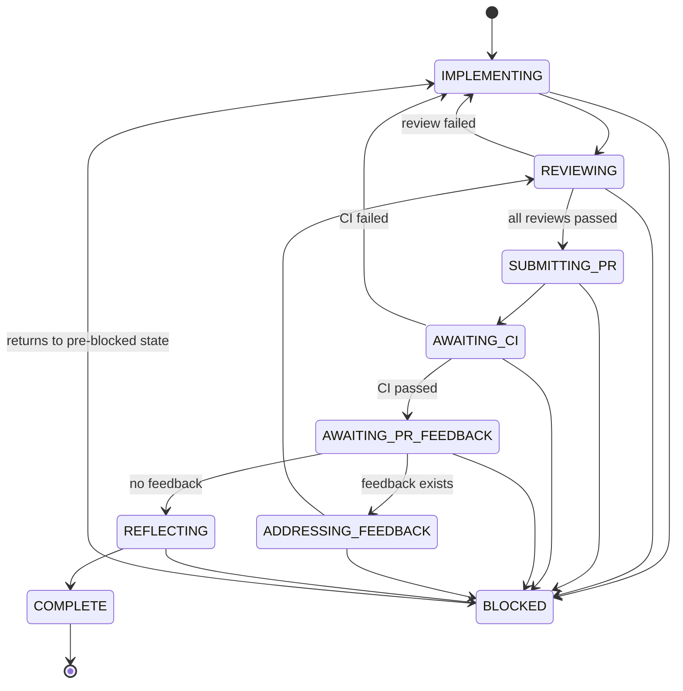

# dev-workflow-v2

An event-sourced state machine plugin for Claude Code that enforces a structured task lifecycle: implement, verify, review, submit PR, await CI, await PR feedback, reflect, complete.

## How to Start

Start a new session in a worktree:

```bash
claude -w
```

Claude Code creates the worktree. The plugin owns everything from task selection onward.

## Commands

### 1. Choose a task

```bash
/dev-workflow-v2:choose-next-task
```

Analyzes parallel work streams across active PRDs, recommends a task from an idle track, and assigns the issue after confirmation.

### 2. Start implementation

```bash
/dev-workflow-v2:start-implementation <issue-number>
```

Renames the worktree branch to match the issue, reads the issue details, initializes the workflow state machine, and begins the IMPLEMENTING state.

### 3. Workflow (internal)

```bash
/dev-workflow-v2:workflow <command>
```

Low-level state machine CLI. Used by the other commands and state instructions — not called directly by users.

Useful internal command for state-driven instructions:

```bash
/dev-workflow-v2:workflow get-state
```

This returns the current workflow state as JSON so state instructions can extract exact values such as `githubIssue`, `prNumber`, and `taskCheckPassed` without guessing.

## State Machine



## User Touchpoints

Most of the workflow is automated. You interact at these points:

1. **Choose task** — `/dev-workflow-v2:choose-next-task` recommends a task; confirm to proceed
2. **Start** — `/dev-workflow-v2:start-implementation <issue>` to begin
3. **Approve plan** — the agent presents an implementation plan for your approval
4. **Review PR** — after the agent creates a PR, review it on GitHub
5. **Merge** — merge the PR when satisfied

## Troubleshooting

| Problem                       | Where to look                                          |
| ----------------------------- | ------------------------------------------------------ |
| Workflow state seems wrong    | Event store: `~/.claude/workflow-events.db`            |
| Hook errors / silent failures | Error log: `~/.claude/dev-workflow-v2-hook-errors.log` |
| Stale NX cache                | Run `pnpm nx reset`                                    |
